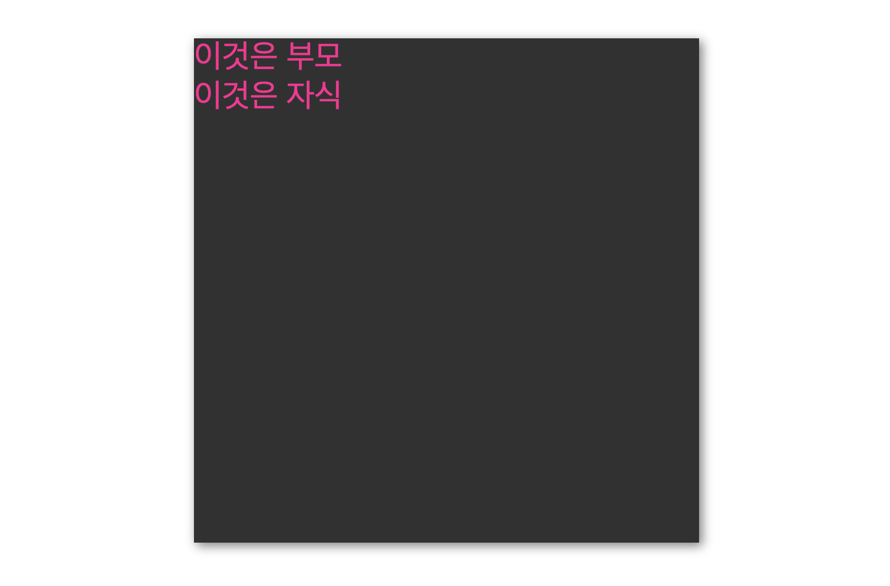
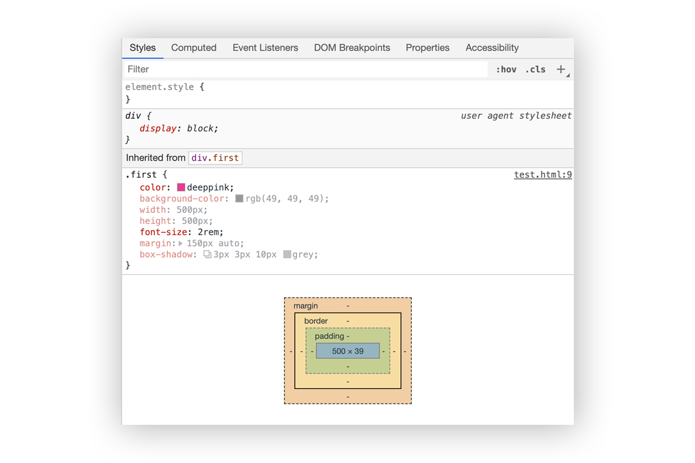
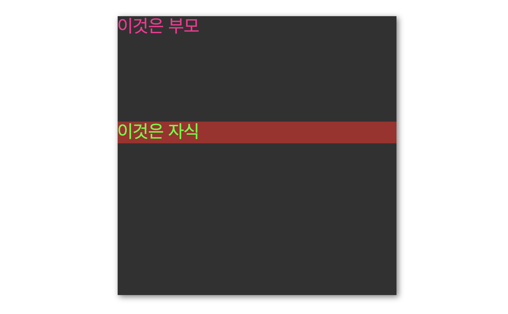

## 상속(Inheritance)이란?
CSS에는 상속이라는 개념이 있다. 말 그대로 부모 요소(Element)의 속성값(Value)을 그대로 물려받는다는 의미인데, 모든 속성값에 상속이 적용되는 것은 아니기 때문에 처음 상속을 배웠을 때 다소 어렵게 느꼈던 기억이 있다.
‘백문이불여일견’이랬으니, 우선 아래의 코드와 결과를 확인해보자.

```html
<head>
    <style>
        .first {
            color: deeppink;
            background-color: rgb(49, 49, 49);
            width: 500px;
            height: 500px;
            font-size: 2rem;
            margin: 150px auto;
            box-shadow: 3px 3px 10px gray;
        }
    </style>
</head>
<body>
    <div class="first">
        이것은 부모
        <div class="second">
            이것은 자식
        </div>
    </div>
</body>
```



코드에서 볼 수 있듯이 first의 하위 태그의 클래스가 second인데, CSS는 first에만 적용했음에도 second까지 변했다. 이것이 CSS의 상속을 단적으로 보여주는 예라고 할 수 있다.

물론 모든 속성이 상속 되지는 않는데, 이는 개발자도구를 실행해보면 아래와 같이 쉽게 확인할 수가 있다.



`Inherited form div.first`라고  명시된 곳을 보면 어떤 속성값들이 상속 되었는지 알 수가 있는데, 그 중에서도 활성화 되어있는 `color`와 `fort-size`가 second에 상속, 적용되었다.

이를 통해 우리가 깨달을 수 있는 것은, 상속이 되어야 편한 속성값들만 상속이 된다는 점이다. 결론적으로, **상속이 있는 이유는 생산성을 높이기 위함**이라고 이해할 수가 있다.  만약, 모든 속성값이 상속 된다면,


이러한 결과가 나왔을 것이다. CSS를 다뤄봤다면 잘 알 테지만, 상속된 속성값 중 필요 없는 것들을 제거 하는 일에 상당한 시간을 할애하게 될 것이다.

**모든 속성값 상속 후 필요 없는 속성값 제거 VS 필요한 속성값 추가**
둘 중 무엇이 더 효율적일지는 곰곰이 생각해보면 누구나 알 수 있을 것이다. 아래와 같이 상속 되지 않는 속성값은 따로 추가하면 되는 것이고, 이미 상속된 속성값 또한 자식 요소에 부여한 속성값이 더 우선 적용 되기 때문에 손쉽게 변경이 가능하다.

그리고, 상속이 되지 않는 속성을 강제로 상속 시키고 싶을 때에는, 아래의 코드에서 `margin`과 같이 속성값으로 `inherit`을 부여하면 상속이 된다.

```html
<head>
    <style>
        .first {
            color: deeppink;
            background-color: rgb(49, 49, 49);
            width: 500px;
            height: 500px;
            font-size: 2rem;
            margin: 150px auto;
            box-shadow: 3px 3px 10px gray;
        }
        .second {
            color: lime;
            background-color: brown;
            margin: inherit;
        }
    </style>
</head>
<body>
    <div class="first">
        이것은 부모
        <div class="second">
            이것은 자식
        </div>
    </div>
</body>
```



상속이 되는 속성값과, 되지 않는 속성값은 아래의 링크에서 자세히 확인할 수 있으니 참고하길 바란다.

링크 바로가기: [Full property table](https://www.w3.org/TR/CSS21/propidx.html)

**참고:**
- [상속 - CSS: Cascading Style Sheets | MDN](https://developer.mozilla.org/ko/docs/Web/CSS/inheritance)